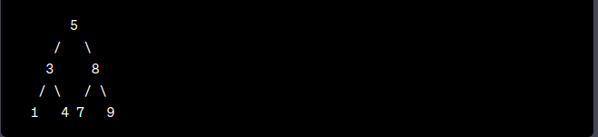

# binary_tree_data_structure
A binary tree is a vertical kind of data structure. It is called "binary" because each node in the tree can have at most two children, referred to as the left child and the right child. 
These children are positioned vertically below their parent node. Hence, the binary tree structure expands downward vertically as nodes are added. 

To visualize a binary tree, you can imagine it as an inverted tree where the root node is at the top and the branches (edges) extend downward.  
Each node can have zero, one, or two child nodes, forming a hierarchical structure. 

Here's an example of a binary tree:  

In this figure, the **root node** is 5 and it has two children : 3 and 8. 

The **left child** of 5 , which is 3, has it own two children , 1 and 4 . 
The **right child** of 5, which is 8, has its own two  children, 7 and 9 .
